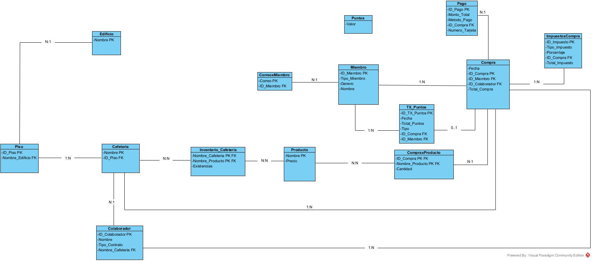

# Proyecto Bases 2
[https://github.com/Achalogy/proj-bases-2](https://github.com/Achalogy/proj-bases-2)

Archivo `.sql` final: [query.sql](https://github.com/Achalogy/proj-bases-2/blob/main/query.sql)

- Miguel Francisco Vargas Contreras `is147208`
- Nicolas Diaz Granados Cano `is147201`
- Sara Rodriguez Urueña `is147206`

# Documentación

## Diseño de la DB

### Diseño E/R

Nuestro primer paso en la construcción de esta Base de datos fue el modelo de Entidad / Relación, en este modelo, se representan varios componentes clave.

Primero, el edificio y los pisos están conectados mediante una relación de pertenencia uno a uno, lo que significa que cada piso está asignado a un solo edificio. Los atributos del edificio incluyen un identificador (ID_Edificio) y su nombre, mientras que los pisos tienen su propio número de piso y están vinculados al edificio correspondiente mediante el ID.

Las cafeterías están asociadas a un piso específico en un edificio a través de una relación de correspondencia. Cada cafetería tiene un identificador (ID_Cafeteria), un nombre y está vinculada tanto al piso como al edificio donde se ubica.

Los colaboradores, que son los empleados de las cafeterías, están relacionados con las cafeterías mediante una relación de pertenencia de uno a muchos, lo que indica que cada cafetería puede tener varios empleados, pero cada empleado pertenece a una sola cafetería. Los colaboradores tienen atributos como su nombre, tipo de contrato y comisión.

Por otro lado, los miembros de la comunidad universitaria tienen su propio conjunto de atributos, como su nombre, correo electrónico, tipo de miembro (empleado, estudiante o profesor), género y puntos acumulados por las compras realizadas en las cafeterías.

Las compras juegan un papel central en este modelo, ya que están conectadas tanto a los miembros de la comunidad como a los colaboradores y productos. Los miembros de la comunidad realizan compras, y estas generan puntos para ellos. A su vez, los colaboradores atienden las compras. Cada compra tiene un identificador, la fecha en que se realizó, el total de la compra y los puntos acumulados en base a esa compra.

Los productos que se venden en las cafeterías están relacionados con las compras a través de una relación de inclusión de muchos a muchos, lo que significa que una compra puede tener muchos productos, y un producto puede formar parte de varias compras. Cada producto tiene su propio identificador, nombre, precio y la cantidad de existencias disponibles.

Además, cada compra está vinculada a un pago a través de una relación de uno a uno. Los pagos tienen atributos como el método de pago utilizado y el monto total. Por último, los impuestos aplicables a las compras se gestionan mediante una relación de aplicación de muchos a muchos, donde diferentes tipos de impuestos y porcentajes pueden aplicarse a distintas compras.

### Diseño Relacional

Después de diseñar el diagrama, pasamos al modelo relacional, lo que permitió identificar varios ajustes en el diseño original. Se creó una tabla independiente llamada CorreoxMiembro, que contiene el correo electrónico como clave primaria y el ID de miembro como clave foránea, eliminando así la dependencia multivaluada de los correos en la tabla Miembro. Esto facilita que cada miembro tenga varios correos asociados.

La información sobre los puntos también se separó en una tabla independiente, lo que ofrece mayor flexibilidad para gestionar los cambios en los valores de puntos a lo largo del tiempo. Además, se diseñó una tabla para registrar las transacciones de puntos, que incluye datos como la fecha, el total de puntos, el tipo de transacción, y las claves foráneas hacia las compras y los miembros. Esto permite un seguimiento detallado de cómo se acumulan o gastan los puntos, con un registro claro vinculado a compras específicas.

Para resolver la relación muchos a muchos entre cafeterías y productos, se creó una tabla intermedia llamada Inventario_Cafetería, lo que facilita el seguimiento del inventario de productos por cada cafetería. También se creó una tabla intermedia entre compras y productos, que registra la cantidad de productos por compra, resolviendo así la relación muchos a muchos entre estas dos entidades.

Se implementó una tabla para gestionar los impuestos aplicados a las compras, que incluye el tipo de impuesto, el porcentaje y el total aplicado a cada compra, lo que permite manejar múltiples tipos de impuestos en una sola transacción.

En cuanto a la tabla de pagos, se añadió el ID de compra como clave foránea, vinculando cada pago con su respectiva compra. Además, se eliminaron atributos redundantes en varias tablas para garantizar que la información esté normalizada y vinculada adecuadamente mediante claves foráneas.

Finalmente, decidimos mantener la segunda forma normal en la relación entre compras e impuestos. Aunque las consultas de agregación pueden ser costosas debido al volumen de transacciones, almacenar ciertos cálculos derivados es más eficiente en este caso, dado que no se actualizan con frecuencia y se consultan con regularidad.

Como regla general (aunqe no estricta) tomamos la decisión deliberada de mantener tablas con atributos calculados que:
a. Se calculan una unica vez y el riesgo de que se llegue a inconsistencias es minimo
b. Se consulta el atributo derivado con alta frecuencia en otros calculos de agregacion 

Se mantienen en 2FN con tal reducir la intensidad computacional de las consultas de agregación. Las tablas que tratasen de registros de entidades en su mayoria estáticas se llevaron a 3FN pues mantener la consistencia de los datos no implicaba un costo computacional significativo y, de hecho, lo reducia permitiendo hacer una unica actualización en lugar de muchas. Tambien cabe resaltar que se intento asignar una especie ID único no compuesto donde fuera posible a cada tabla para acercarlas a 2FN.

A continuación, detallamos las procesos de normalizacion tabla a tabla y explicamos en detalle por que se mantuvieron en 2FN o se llevaron a 3FN según la lógica de negocio donde sea relevante o no evidente el por que:

Edificio:
- 3FN
- Es trivial pues la unica dependencia funcional es la de su llave primaria consigo misma
- Nombre -> Nombre

Piso:
- 3FN
- Piso se mantiene en 3FN principalmente gracias al hecho de su relacion 1:N con edificio. Es imposible identificar un piso a partir del edificio al que esta asociado (pues un edificio puede tener multitud de pisos) pero un edificio único siempre puede ser identificado por un piso, pues cada piso tiene una ID única asociada. Asi tenemos dependencia total de la llave primaria y no hay dependencias transitivas pues no hay más atributos no clave.
- ID_Piso -> Nombre_Edificio

Cafeteria:
- 3FN
- Mismo principio que la tabla "Piso". Relación 1:N con Piso vuelven imposible identificar una única cafeteria por el piso, pero lo inverso si es cierto.
- Nombre_Cafeteria -> Piso

Colaborador:
- 3FN
- Un colaborador tiene un identificador único. Es posible que existan colaboradores con el mismo nombre. Una cafeteria puede tener multiples trabajadores asi que es imposible inferir un único colaborador a partir de ese atributo.
- ID_Colaborador -> {Nombre, Tipo_Contrato, Nombre_Cafeteria}

Inventario_Cafeteria:
- 3FN
- Las existencias de un producto son independientes cafeteria a cafeteria, por ende se requiere de una llave compuesta que identifique y asocie las existencias de un producto dentro de una cafeteria especifica. Múltiples cafeterias diferentes pueden tener la misma existencia de un mismo prodcuto. Hay dependencia total de la llave primaria compuesta.
- {Nombre_Cafeteria, Nombre_Producto} -> Existencias

Producto:
- 3FN
- Única dependencia del atributo clave, la dependencia no es invertible por el hecho de que diferentes productos pueden tener el mismo precio.
- Nombre_Producto -> Precio

CompraxProducto:
- 3FN
- La relación entre una compra y una cantidad de prodcutos. La cantidad de un producto por compra depende directamente de en que compra se hizo de que producto se compró (no tendria ningún tipo de sentido haber comprado 5 nadas) y por eso existe dependecia total de la llave primaria, además de no haber dependencias transitivas de por medio.
- {Nombre_Producto, ID_Compra} -> Cantidad

Compra:
- 2FN
- A pesar de que se garantiza dependencia total de la llave primaria (pues una compra posee un identificador único y por la naturaleza de asociacion N:1 con miembro y colaborador se implica que un colaborador le puede hcaer muchas ventas a un único miembro por lo que este identificador es lo único que genuinamente puede diferenciar compras) y a simple vista no existen dependencias transitivas dentro de la tabla, se asumiría que está en 3FN, sin embargo, Total_Compra es un elemento que se puede derivar de atributos de OTRAS tablas lo cual por definición viola FN3, pues Total_Compra puede ser inferido a traves de CompraxProducto y Producto (Cantidad x precio por cada tupla asociada) junto con ImpuestoxCompra (El impuesto agregado al subtotal). Sin embargo, se toma la decisión deliberada de mantenerla en 2FN, ya que es necesario poder calcular las comisiones de cada colaborador con eficiencia y tener que recalcular el valor total de una compra, que se somete a multiples impuestos y multiples diferentes productos de precios variables no solo pone en riesgo la integridad del valor (pues el precio de un producto puede cambiar con el tiempo) sino que se vuelve extremadamente demandante en cuanto a poder computacional y complica innecesariamente la estructura de las consultas.
- ID_Compra -> {ID_Miembro, ID_Colaborador, Fecha, Total_Compra} donde Total_Compra se infiere de atributos externos.

ImpuestoxCompra, TX_Puntos:
- 2FN, 2FN
- La decisión sigue exactamente el mismo criterio que para la tabla compra, donde esta vez los atributos calculados son Total_Puntos (generados por una compra) y Total_Impuesto (Añadido al subtotal, en este caso se infiere directamente desde la tabla por medio de porcentaje pues subtotal*porcentaje=Total_Impuesto).
- ID_Impuesto -> {Tipo_Impuesto, porcentaje, ID_Compra, Total_Impuesto} donde existe la dependencia parcial transitiva Porcentaje -> Total_Impuesto
- ID_TX_Puntos -> {Fecha, Total_Puntos, Tipo, ID_Compra, ID_Miembro} donde Total_Puntos se infiere de cálculos con atributos externos

Pago:
- 3FN
- Pago no posee ningún atributo calculado y sigue los principios de depedencia total sobre la llave primaria para 2FN y no existen dependencias transitivas por lo que se entiende 3FN
- ID_Pago -> {Monto_Total, Metodo_Pago, ID_Compra, Numero_Tarjeta}

Puntos:
- 3FN
- Dependencia trivial, su llave es su único atributo y no es calculado.
- Valor -> Valor

Miembro:
- 3FN 
- Se logra su identificación total por medio de su ID, sus campos multivaluados se han descompuesto en la relación CorreoxMiembro.
- ID_Miembro -> {Tipo_Miembro, Genero, Nombre}

CorreoxMiembro:
- 3FN
- Garantiza que miembro se pueda encontrar en 1FN. Ella misma se encuentra en 3FN ya que un ID_Miembro no identifica a un unico correo sino a varios, pero la afirmación contraria si se cumple pues un correo siempre estará asociado a un ID especifico.
- Correo -> ID_Miembro

## Datos Usados

### Edificios

|          Nombre Edificio           | Cantidad Pisos | Cafetería ID Piso |
|:----------------------------------:|:--------------:|:-----------------:|
|         Ed. Fernando Baron         |       3        |         1         |
|        Ed. Gabriel Giraldo         |       2        |         5         |
|         Ed. Arango Puerta          |       3        |         7         |
|             Ed. Atico              |       2        |        10         |
|        Ed. Julio Carrizosa         |       2        |        11         |
|     Ed. Jose Gabriel Maldonado     |       3        |        13         |
|      Ed. Jorge Hoyoso Vasques      |       4        |        17         |
|         Ed. Emilio Arango          |       3        |        21         |
|         Facultad de Artes          |       2        |        24         |
| Hospital Universitario San Ignacio |       3        |        27         |
|            Ed. Pablo VI            |       3        |        28         |
|         Ed. Felix Restrepo         |       3        |        32         |
|      Ed. Jose Rafael Arboleda      |       5        |        37         |

### Productos

| No. | Nombre            | Precio |
|-----|-------------------|--------|
| 1   | Té                | 5000   |
| 2   | Galleta           | 1500   |
| 3   | Bebida Energética | 8000   |
| 4   | Ensalada          | 12000  |
| 5   | Fruta             | 2500   |
| 6   | Agua              | 1000   |
| 7   | Sopa              | 7000   |
| 8   | Wrap              | 15000  |
| 9   | Bocadillo         | 3000   |
| 10  | Helado            | 4500   |
| 11  | Smoothie          | 10000  |
| 12  | Brownie           | 3500   |
| 13  | Pizza             | 20000  |
| 14  | Hot Dog           | 6000   |
| 15  | Croissant         | 2500   |

### Trabajadores

| No. | Nombre           | Tipo_Contrato | Nombre_Cafeteria |
|-----|------------------|---------------|------------------|
| 1   | María González   | PLANTA        | Cafetería A      |
| 2   | Pedro López      | TEMPORAL      | Cafetería A      |
| 3   | Sofía Martínez   | PLANTA        | Cafetería B      |
| 4   | Luis Ramírez     | TEMPORAL      | Cafetería B      |
| 5   | Ana Torres       | PLANTA        | Cafetería C      |
| 6   | Javier Gómez     | TEMPORAL      | Cafetería C      |
| 7   | Clara Fernández  | PLANTA        | Cafetería D      |
| 8   | Diego Herrera    | TEMPORAL      | Cafetería D      |
| 9   | Elena Martínez   | PLANTA        | Cafetería E      |
| 10  | Fernando Torres  | TEMPORAL      | Cafetería E      |
| 11  | Gabriel Salazar  | PLANTA        | Cafetería F      |
| 12  | Isabel Rojas     | TEMPORAL      | Cafetería F      |
| 13  | Julián Suárez    | PLANTA        | Cafetería G      |
| 14  | Karla Medina     | TEMPORAL      | Cafetería G      |
| 15  | Laura Castillo   | PLANTA        | Cafetería H      |
| 16  | Martín Vega      | TEMPORAL      | Cafetería H      |
| 17  | Nicolás Acosta   | PLANTA        | Cafetería I      |
| 18  | Olga López       | TEMPORAL      | Cafetería I      |
| 19  | Pablo Gómez      | PLANTA        | Cafetería J      |
| 20  | Rosa Martínez    | TEMPORAL      | Cafetería J      |
| 21  | Santiago Díaz    | PLANTA        | Cafetería K      |
| 22  | Teresa Ramírez   | TEMPORAL      | Cafetería K      |
| 23  | Ulises Moreno    | PLANTA        | Cafetería L      |
| 24  | Valeria Silva    | TEMPORAL      | Cafetería L      |
| 25  | Walter Hernández | PLANTA        | Cafetería M      |
| 26  | Ximena González  | TEMPORAL      | Cafetería M      |

### Productos

| Nombre del Edificio | Té | Galleta | Bebida Energética | Ensalada | Fruta | Agua | Sopa | Wrap | Bocadillo | Helado | Smoothie | Brownie | Pizza | Hot Dog | Croissant |
|:-------------------:|:--:|:-------:|:-----------------:|:--------:|:-----:|:----:|:----:|:----:|:---------:|:------:|:--------:|:-------:|:-----:|:-------:|:---------:|
|     Cafetería A     | 12 |    3    |         0         |    0     |  12   |  9   |  8   |  0   |    11     |   5    |    0     |   12    |   7   |   11    |     9     |
|     Cafetería B     | 12 |   13    |         0         |    6     |   9   |  0   |  3   |  4   |     4     |   8    |    12    |   12    |  13   |   14    |     0     |
|     Cafetería C     | 14 |    0    |        10         |    0     |  10   |  12  |  4   |  13  |     9     |   4    |    11    |   12    |   4   |    4    |    11     |
|     Cafetería D     | 14 |    5    |         4         |    7     |  13   |  4   |  0   |  0   |     9     |   4    |    12    |   12    |  13   |    6    |     0     |
|     Cafetería E     | 12 |   12    |        10         |    0     |   6   |  14  |  7   |  0   |     9     |   4    |    11    |    0    |   0   |    0    |    12     |
|     Cafetería F     | 5  |    8    |         6         |    0     |   7   |  14  |  9   |  7   |     7     |   0    |    5     |    6    |   7   |    0    |    13     |
|     Cafetería G     | 11 |    9    |         3         |    9     |   4   |  11  |  3   |  0   |     0     |   0    |    11    |    3    |  11   |   10    |     7     |
|     Cafetería H     | 11 |    4    |         0         |    0     |   6   |  12  |  8   |  0   |     3     |   12   |    4     |   14    |  10   |    9    |     3     |
|     Cafetería I     | 0  |   10    |        10         |    10    |   0   |  11  |  10  |  7   |     5     |   11   |    3     |   13    |  14   |   11    |     6     |
|     Cafetería J     | 0  |   10    |        14         |    9     |   3   |  12  |  0   |  0   |     0     |   4    |    12    |   10    |  14   |    6    |     0     |
|     Cafetería K     | 14 |    6    |        11         |    3     |  11   |  7   |  7   |  11  |    14     |   11   |    11    |    8    |   4   |   13    |    12     |
|     Cafetería L     | 7  |   11    |         4         |    13    |   7   |  11  |  6   |  9   |     0     |   11   |    13    |    8    |  11   |    6    |     0     |
|     Cafetería M     | 8  |   14    |         6         |    0     |   0   |  0   |  0   |  11  |     7     |   10   |    5     |   13    |  11   |   14    |    12     |