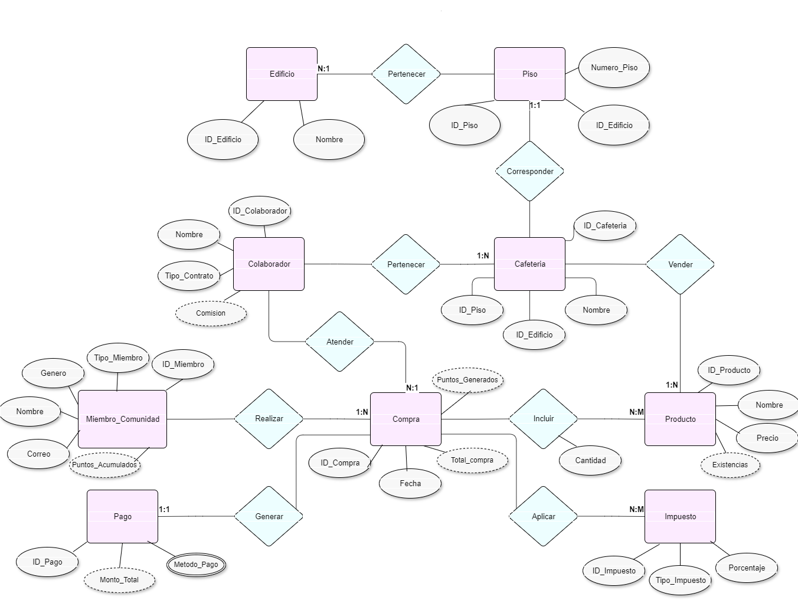

# Proyecto Bases 2
[https://github.com/Achalogy/proj-bases-1](https://github.com/Achalogy/proj-bases-1)

Archivo `.sql` final: [query.sql](https://github.com/Achalogy/proj-bases-1/blob/main/query.sql)

- Miguel Francisco Vargas Contreras `is147208`
- Nicolas Diaz Granados Cano `is147201`
- Sara Rodriguez Urueña `is147206`

# Documentación

## Diseño de la DB

### Diseño E/R

Nuestro primer paso en la construcción de esta Base de datos fue el modelo de Entidad / Relación, en este modelo, se representan varios componentes clave.

Primero, el edificio y los pisos están conectados mediante una relación de pertenencia uno a uno, lo que significa que cada piso está asignado a un solo edificio. Los atributos del edificio incluyen un identificador (ID_Edificio) y su nombre, mientras que los pisos tienen su propio número de piso y están vinculados al edificio correspondiente mediante el ID.

Las cafeterías están asociadas a un piso específico en un edificio a través de una relación de correspondencia. Cada cafetería tiene un identificador (ID_Cafeteria), un nombre y está vinculada tanto al piso como al edificio donde se ubica.

Los colaboradores, que son los empleados de las cafeterías, están relacionados con las cafeterías mediante una relación de pertenencia de uno a muchos, lo que indica que cada cafetería puede tener varios empleados, pero cada empleado pertenece a una sola cafetería. Los colaboradores tienen atributos como su nombre, tipo de contrato y comisión.

Por otro lado, los miembros de la comunidad universitaria tienen su propio conjunto de atributos, como su nombre, correo electrónico, tipo de miembro (empleado, estudiante o profesor), género y puntos acumulados por las compras realizadas en las cafeterías.

Las compras juegan un papel central en este modelo, ya que están conectadas tanto a los miembros de la comunidad como a los colaboradores y productos. Los miembros de la comunidad realizan compras, y estas generan puntos para ellos. A su vez, los colaboradores atienden las compras. Cada compra tiene un identificador, la fecha en que se realizó, el total de la compra y los puntos acumulados en base a esa compra.

Los productos que se venden en las cafeterías están relacionados con las compras a través de una relación de inclusión de muchos a muchos, lo que significa que una compra puede tener muchos productos, y un producto puede formar parte de varias compras. Cada producto tiene su propio identificador, nombre, precio y la cantidad de existencias disponibles.

Además, cada compra está vinculada a un pago a través de una relación de uno a uno. Los pagos tienen atributos como el método de pago utilizado y el monto total. Por último, los impuestos aplicables a las compras se gestionan mediante una relación de aplicación de muchos a muchos, donde diferentes tipos de impuestos y porcentajes pueden aplicarse a distintas compras.

### Diseño Relacional

Después de diseñar el diagrama, pasamos al modelo relacional, lo que nos permitió identificar varios ajustes necesarios en el diseño propuesto.

Decidimos mantener la segunda forma normal (2FN) en la relación entre compra e impuesto. En consultas donde sea necesario recuperar el total de ventas o compras, el gran volumen de transacciones que podría manejar la base de datos haría que las consultas de agregación o cálculos derivados consumieran muchos recursos. Por ello, es más eficiente almacenar estos cálculos derivados, ya que no se actualizan y se consultan con frecuencia.

## Datos Usados

### Edificios

|          Nombre Edificio           | Cantidad Pisos | Cafetería ID Piso |
|:----------------------------------:|:--------------:|:-----------------:|
|         Ed. Fernando Baron         |       3        |         1         |
|        Ed. Gabriel Giraldo         |       2        |         5         |
|         Ed. Arango Puerta          |       3        |         7         |
|             Ed. Atico              |       2        |        10         |
|        Ed. Julio Carrizosa         |       2        |        11         |
|     Ed. Jose Gabriel Maldonado     |       3        |        13         |
|      Ed. Jorge Hoyoso Vasques      |       4        |        17         |
|         Ed. Emilio Arango          |       3        |        21         |
|         Facultad de Artes          |       2        |        24         |
| Hospital Universitario San Ignacio |       3        |        27         |
|            Ed. Pablo VI            |       3        |        28         |
|         Ed. Felix Restrepo         |       3        |        32         |
|      Ed. Jose Rafael Arboleda      |       5        |        37         |

### Productos

| No. | Nombre            | Precio |
|-----|-------------------|--------|
| 1   | Té                | 5000   |
| 2   | Galleta           | 1500   |
| 3   | Bebida Energética | 8000   |
| 4   | Ensalada          | 12000  |
| 5   | Fruta             | 2500   |
| 6   | Agua              | 1000   |
| 7   | Sopa              | 7000   |
| 8   | Wrap              | 15000  |
| 9   | Bocadillo         | 3000   |
| 10  | Helado            | 4500   |
| 11  | Smoothie          | 10000  |
| 12  | Brownie           | 3500   |
| 13  | Pizza             | 20000  |
| 14  | Hot Dog           | 6000   |
| 15  | Croissant         | 2500   |

### Trabajadores

| No. | Nombre           | Tipo_Contrato | Nombre_Cafeteria |
|-----|------------------|---------------|------------------|
| 1   | María González   | PLANTA        | Cafetería A      |
| 2   | Pedro López      | TEMPORAL      | Cafetería A      |
| 3   | Sofía Martínez   | PLANTA        | Cafetería B      |
| 4   | Luis Ramírez     | TEMPORAL      | Cafetería B      |
| 5   | Ana Torres       | PLANTA        | Cafetería C      |
| 6   | Javier Gómez     | TEMPORAL      | Cafetería C      |
| 7   | Clara Fernández  | PLANTA        | Cafetería D      |
| 8   | Diego Herrera    | TEMPORAL      | Cafetería D      |
| 9   | Elena Martínez   | PLANTA        | Cafetería E      |
| 10  | Fernando Torres  | TEMPORAL      | Cafetería E      |
| 11  | Gabriel Salazar  | PLANTA        | Cafetería F      |
| 12  | Isabel Rojas     | TEMPORAL      | Cafetería F      |
| 13  | Julián Suárez    | PLANTA        | Cafetería G      |
| 14  | Karla Medina     | TEMPORAL      | Cafetería G      |
| 15  | Laura Castillo   | PLANTA        | Cafetería H      |
| 16  | Martín Vega      | TEMPORAL      | Cafetería H      |
| 17  | Nicolás Acosta   | PLANTA        | Cafetería I      |
| 18  | Olga López       | TEMPORAL      | Cafetería I      |
| 19  | Pablo Gómez      | PLANTA        | Cafetería J      |
| 20  | Rosa Martínez    | TEMPORAL      | Cafetería J      |
| 21  | Santiago Díaz    | PLANTA        | Cafetería K      |
| 22  | Teresa Ramírez   | TEMPORAL      | Cafetería K      |
| 23  | Ulises Moreno    | PLANTA        | Cafetería L      |
| 24  | Valeria Silva    | TEMPORAL      | Cafetería L      |
| 25  | Walter Hernández | PLANTA        | Cafetería M      |
| 26  | Ximena González  | TEMPORAL      | Cafetería M      |

### Productos

| Nombre del Edificio | Té | Galleta | Bebida Energética | Ensalada | Fruta | Agua | Sopa | Wrap | Bocadillo | Helado | Smoothie | Brownie | Pizza | Hot Dog | Croissant |
|:-------------------:|:--:|:-------:|:-----------------:|:--------:|:-----:|:----:|:----:|:----:|:---------:|:------:|:--------:|:-------:|:-----:|:-------:|:---------:|
|     Cafetería A     | 12 |    3    |         0         |    0     |  12   |  9   |  8   |  0   |    11     |   5    |    0     |   12    |   7   |   11    |     9     |
|     Cafetería B     | 12 |   13    |         0         |    6     |   9   |  0   |  3   |  4   |     4     |   8    |    12    |   12    |  13   |   14    |     0     |
|     Cafetería C     | 14 |    0    |        10         |    0     |  10   |  12  |  4   |  13  |     9     |   4    |    11    |   12    |   4   |    4    |    11     |
|     Cafetería D     | 14 |    5    |         4         |    7     |  13   |  4   |  0   |  0   |     9     |   4    |    12    |   12    |  13   |    6    |     0     |
|     Cafetería E     | 12 |   12    |        10         |    0     |   6   |  14  |  7   |  0   |     9     |   4    |    11    |    0    |   0   |    0    |    12     |
|     Cafetería F     | 5  |    8    |         6         |    0     |   7   |  14  |  9   |  7   |     7     |   0    |    5     |    6    |   7   |    0    |    13     |
|     Cafetería G     | 11 |    9    |         3         |    9     |   4   |  11  |  3   |  0   |     0     |   0    |    11    |    3    |  11   |   10    |     7     |
|     Cafetería H     | 11 |    4    |         0         |    0     |   6   |  12  |  8   |  0   |     3     |   12   |    4     |   14    |  10   |    9    |     3     |
|     Cafetería I     | 0  |   10    |        10         |    10    |   0   |  11  |  10  |  7   |     5     |   11   |    3     |   13    |  14   |   11    |     6     |
|     Cafetería J     | 0  |   10    |        14         |    9     |   3   |  12  |  0   |  0   |     0     |   4    |    12    |   10    |  14   |    6    |     0     |
|     Cafetería K     | 14 |    6    |        11         |    3     |  11   |  7   |  7   |  11  |    14     |   11   |    11    |    8    |   4   |   13    |    12     |
|     Cafetería L     | 7  |   11    |         4         |    13    |   7   |  11  |  6   |  9   |     0     |   11   |    13    |    8    |  11   |    6    |     0     |
|     Cafetería M     | 8  |   14    |         6         |    0     |   0   |  0   |  0   |  11  |     7     |   10   |    5     |   13    |  11   |   14    |    12     |